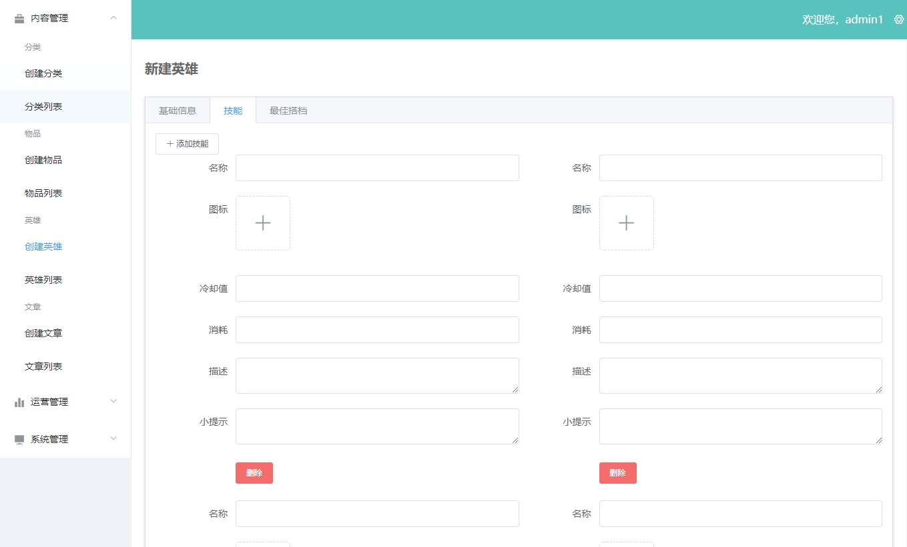

<!--
 * @message: 
 * @Author: lzh
 * @since: 2019-11-05 11:23:25
 * @lastTime: 2019-11-22 15:09:26
 * @LastAuthor: lzh
 -->
# node-vue-wzry
基于node+express+mongodb实现接口；vue+element-ui实现后台管理；vue全家桶实现前端页面；的仿王者荣耀移动端官网项目
***

- 通用 CRUD 接口
- 广告位
- 分类
- 物品
- 英雄
- 文章
- 管理员账号
- 文件上传
- 富文本编辑器
- 登录
    - 密码散列加密(bcrypt)
    - token (jsonwebtoken)
    - 服务端登录校验
    - 客户端路由限制（beforeEach,meta）

## 实现截图如下：

